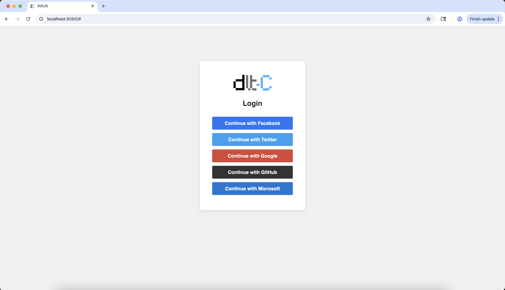
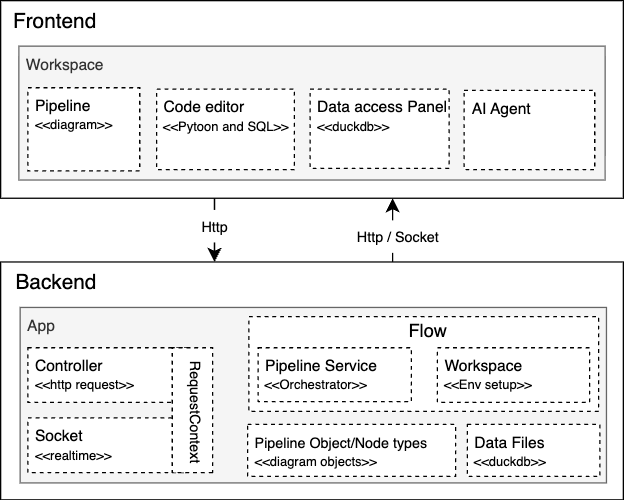

<br>

DLT Client is an MVP Data Engineering project designed to build ETL pipelines through a web interface, using low/no-code features.

In terms of stack the front end is build in <a href="https://stilljs.dev/">Still.js</a> framework and the Backend is built in <a href="https://dlthub.com/">dlt-hub (Python)</a>. This is a single repository comprising both the backend and the UI.

There is a [live version](https://mvp1.dlt-c.cloud/#) deployed in cloud, you can access and test it using social login.

<br>

##### Table of Contents  
- [Project Structure](#project-structure-overview)
    - [Environment Prerequisites](#env-prerequisites)
    - [Setup Backend](#backend-setup)
    - [Setup Frontend - Option1](#backend-frontend)
    - [Setup Frontend - Option2](#backend-frontend2)
- [Login into the application - video](#loging-in-ui)
- [Videos - see some features in action](#some-features)
[Architecture](#architecture)
[Design System overview](#design-system)

<a name="project-structure-overview"></a>
### 🧱 Project Structure Overview

```js
.
├── docker-compose.yml
├── backend/
│   └── Dockerfile
│   └── src
│       └── ...│
├── ui/
│   └── Dockerfile
│   └── app
│       └── ...
└── README.md
```
<br>

<a name="env-prerequisites"></a>
### Environment Prerequisites

<b>Backend:</b>

>[Python >=3.12.0](https://www.python.org/downloads/):
<br>Either run straight in the machine or create virtual environment and point it to version >=3.12.0 for Python

<b>Frontend:</b>

> Install Still-cli or just serve with a Webserver like Nginx/Apache
<br>&nbsp;&nbsp;&nbsp;&nbsp;Option1 (Stilljs): `npm install @stilljs/cli -g` <span style="color: lightgray;">//Requires Nodejs and NPM</span>
<br>&nbsp;&nbsp;&nbsp;&nbsp;Option2 (Nginx): [Linux/Mac](https://nginx.org/en/docs/install.html), [Windows](https://nginx.org/en/docs/windows.html)


<b>Duckdb:</b>

> Install according to the OS, follow the [link](https://duckdb.org/install/?platform=macos&environment=cli).
<br>For MVP1, Duckdb has been the only used destination of pipeline output.

<br>
<a name="backend-setup"></a>

## Set up Backend

After cloning/downloading the repository follow the steps a bellow:

1. `cd backend/` <span style="color: lightgray;">//From the root of project</span>
2. `pip install -r requirements.txt` <span style="color: lightgray;">//Dependencies installation</span>
3. change the ***src/.env*** accordingly or leave it as default:
    - ALLOW_ORIGINS=http://127.0.0.1:8080, http://localhost:8080
    - APP_SRV_ADDR=http://localhost:8000
    - GROQ_API_KEY=  
    - TOTAL_ALLOWED_UPLOADS=-1
    - CONVERSATION_TURN_LIMIT=-1  
4. `python src/app.py` <span style="color: lightgray;">//running the application</span>

Expected output:


<br>

**NOTE (Environment variables):** 
> **APP_SRV_ADDR** is the address of the application itself, this is used by task schedule which is used to schedule DLT pipeline.

> **GROQ_API_KEY** is used by the AI agent which initially is using <b>Groq</b> you can create a free account and generate a key.

> **TOTAL_ALLOWED_UPLOADS** is used to set a limit (if neede) on how many data files (e.g. csv) each user/account can upload.

> **CONVERSATION_TURN_LIMIT** is used to set a limit (if neede) on how many messages can be sent to AI agent per day.

<br>

<a name="backend-frontend"></a>

## Set up Frontend

**Option1:**
1. `cd ui/` <span style="color: lightgray;">//From the root of project</span>
2. In ***config/settings/dev.json*** change the accordingly:
    - httpClient.baseUrl <span style="color: lightgray;">//Backend address (e.g. http://localhost:8000)</span>

    - websocketAddr <span style="color: lightgray;">// e.g. <a>ws://localhost:8000/pipeline</a></span>

    - anonymousLogin <span style="color: lightgray;">// e.g. true, as for dev environment it's convinient to avoid using auth0</a></span>
3. `st serve` <span style="color: lightgray;">//running the frontend</span>

Expected output:


<a name="backend-frontend2"></a>

**Option2:**
1. Do step 1 and 2 from Option1

2. There are several online tutorial on how to serve static content depending on your OS (Windows, Linux, MacOS), please google it.


**NOTE (Environment variables):** 
> **httpClient.baseUrl** This will point to the Backend set address in the environment variable **APP_SRV_ADDR**.

> **websocketAddr** This will point to the Backend IP/Domain, and prefixed with ***ws://*** and suffixed with ***/pipeline***. (e.g. ws://localhost:8000/pipeline)

> **anonymousLogin** allows login access without authentication. Currently, authentication uses Auth0 (free license available). To enable Auth0, set **auth0.domain** and **auth0.clientId**, and making anonymousLogin false.

<br>

<a name="loging-in-ui"></a>

### Loging in the UI
- You'll access the ui from http://localhost:8080 (with Stilljs) or the defined port accordingly. The Frontend address and port needs to match with any of the set ALLOW_ORIGINS.

Follow bellow the result with anonymous login:


<br>
<br>

If auth0 is active and anonymousLogin is set to false, user can login using social login options (Google, Github, Facebook, etc.) as we can see in the bellow picture:




<a name="some-features"></a>

## Youtube video of some features in action

1. [Creating a basic pipeline](https://youtu.be/55pK4jzUXVQ)

2. [Scheduling a job for pipeline](https://youtu.be/OuzI65-iMos)

3. [Pipeline versioning, Data transformation and File system sourceing](https://youtu.be/Do5xXC7_d8Y)

<br><hr>

## Architecture

<a name="architecture"></a>

### Overview



<br>
<br>

<a name="design-system"></a>

### Design System overview


<br><hr>