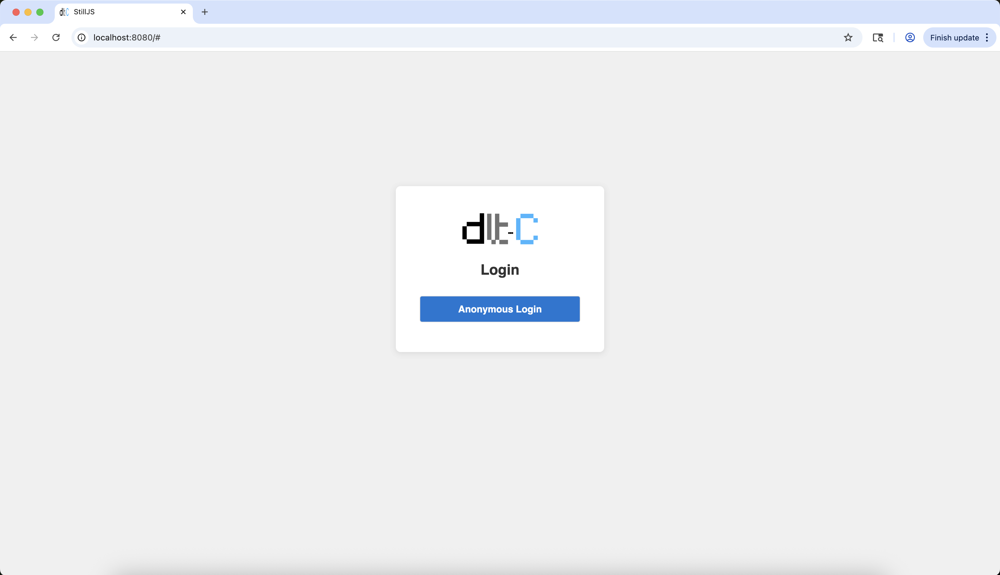
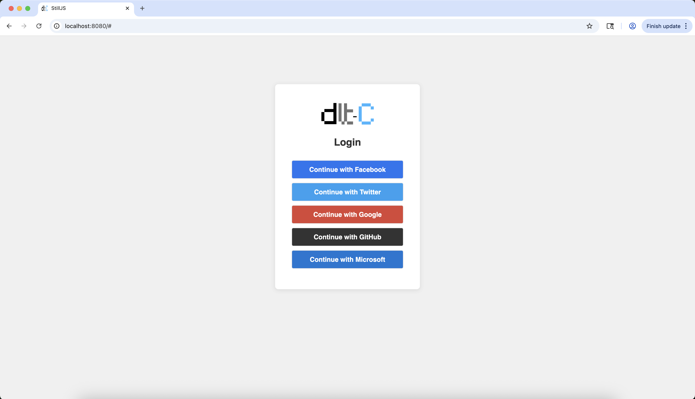

# Setup

To see a walk-through of the setup process see <a href="https://youtu.be/XtUrSKXlOWo" target="_blank">this video</a>.
The setup process should be similar on both Windows, macOS and Linux. Otherwise, feel free to follow the 
steps outlined below to set up the backend, frontend and other additional software.

## Setting up the Backend

Install Duckdb (which For MVP1, Duckdb has been the only used destination of pipeline output):

```
curl https://install.duckdb.org | sh
```

Ensure you are running python `3.12.0` or above. 

if you have `asdf` use the following command to install it:

```
asdf install python 3.12.0
```

if not, download python from the [official website](https://www.python.org/downloads/)

From the root of the project, cd into the backend folder:

``
cd backend/
``

Run the following command to install the necessary dependencies: 

```
pip install -r requirements.txt
```

Optionally, change the configuration in `***src/.env`:

```text
ALLOW_ORIGINS=http://127.0.0.1:8080, http://localhost:8080
APP_SRV_ADDR=http://localhost:8000
GROQ_API_KEY="YOUR_GROQ_API_KEY" 
TOTAL_ALLOWED_UPLOADS=-1
CONVERSATION_TURN_LIMIT=-1
```

| Environment Variable       | Description                                                                                                           |
|----------------------------|-----------------------------------------------------------------------------------------------------------------------|
| **APP_SRV_ADDR**           | The address of the application itself. Used by the task scheduler to schedule the DLT pipeline.                       |
| **GROQ_API_KEY**           | Used by the AI agent (currently powered by **Groq**). You can create a free account on Groq and generate an API key. |
| **TOTAL_ALLOWED_UPLOADS**  | Sets an optional limit on how many data files (e.g., CSV) each user/account can upload.                                |
| **CONVERSATION_TURN_LIMIT**| Sets an optional daily limit on how many messages a user can send to the AI agent.                                    |


As mandatory step, setup the Hashicorp vault using the valut/docker-compose.yml

```
docker compose -f valut/docker-compose.yml up -d
```

Update Vault env vars per vault/docker-compose.yml.

```text
HASHICORP_HOST=http://127.0.0.1:8200
HASHICORP_TOKEN=root
```

Now run the app:

```
python src/app.py
```

You should see output similar to the following:
```
Server initialized for threading.
 * Serving Flask app 'app'
 * Debug mode: off
WARNING: This is a development server. Do not use it in a production deployment. Use a production WSGI server instead.
 * Running on all addresses (0.0.0.0)
 * Running on http://127.0.0.1:8000
 * Running on http://192.168.100.16:8000
Press CTRL+C to quit
```

## Setting up the Frontend

Install the `still-cli`:

```
npm install @stilljs/cli -g
```

Or, optionally serve the frontend using Nginx/Apache.

cd into the ui directory:

```
cd ui/
```

Update the settings in `config/settings/dev.json` as necessary, per your environment:

```text
{
    "httpClient": {
        "baseUrl": "http://localhost:8000"
    },
    "websocketAddr": "ws://127.0.0.1:8000/pipeline",
    ...
    "anonymousLogin": false,
    "fileUploadSizeLimit": "500m",
    "maxAgentConversationTurns": null
}
```

| Variable                  | Description                                                                                                                                    |
|---------------------------|------------------------------------------------------------------------------------------------------------------------------------------------|
| **httpClient.baseUrl**    | Points to the backend API. Should be set to the same address defined in the server-side environment variable **APP_SRV_ADDR**.                |
| **websocketAddr**         | WebSocket endpoint for the pipeline. Must be the backend IP/domain prefixed with `ws://` and suffixed with `/pipeline` (e.g., `ws://localhost:8000/pipeline`). |
| **anonymousLogin**        | When `true`, allows users to log in without authentication. Authentication is handled by Auth0 (free tier available). To enable Auth0, set `auth0.domain` and `auth0.clientId`, and set **anonymousLogin** to `false`. |
| **auth0.domain**          | (Required for Auth0) Your Auth0 domain (e.g., `your-app.us.auth0.com`). Only needed when **anonymousLogin** is `false`.                       |
| **auth0.clientId**        | (Required for Auth0) Your Auth0 client ID. Only needed when **anonymousLogin** is `false`.                                                     |

Build and run the frontend using the StillJS CLI:

```
st serve
```

### Logging in

You'll access the frontend from http://localhost:8080 (with StillJS) or using the port you have defined. The Frontend 
address and port needs to match with any of the set ALLOW_ORIGINS.

To log in anonymously, ensure the `anonymousLogin` option is set to `true` in `config/settings/dev.json`.



If auth0 is active and anonymousLogin is set to false, you can log in using the various social login options 
(Google, Github, Facebook, etc.) as we can see in the below:

